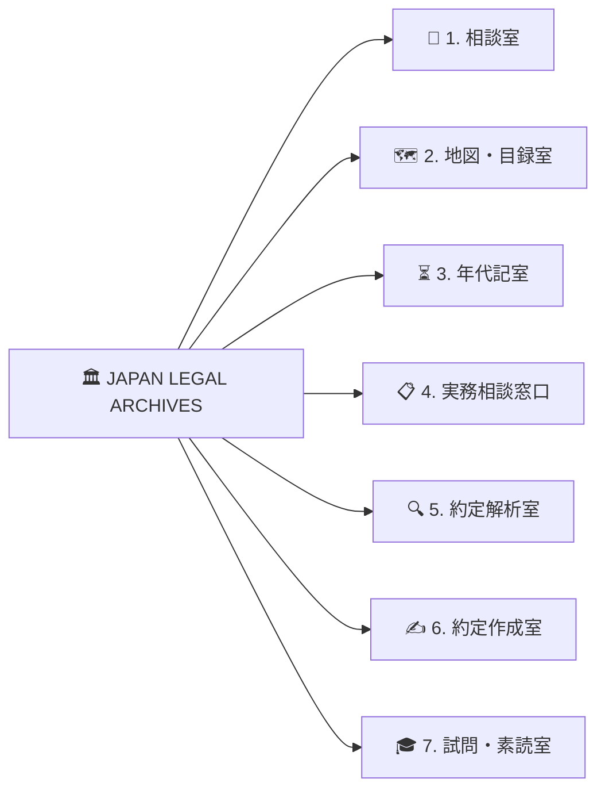

# 🏛️ JAPAN LEGAL ARCHIVES ＆ READING ROOM 〜 日本帝国法令図書館 〜

> **e-Gov法令API v2 × Google Gemini AI**  
> 大英博物館・大英図書館の円形閲覧室（Round Reading Room）をモチーフにした、クラシックかつ最高峰の知性を宿すオールインワン法令司書Webアプリケーション。

[](https://opensource.org/licenses/MIT)
[](https://www.typescriptlang.org/)
[](https://vitejs.dev/)
[](https://laws.e-gov.go.jp/api/2/swagger-ui)

---

## 🏛️ 全7つの機能室（Rooms）



1. **📖 相談室（AI司書対話 ＆ 条文引当）**
   - 自然な日常語で法律の相談をすると、Gemini AI司書が論点を整理し、e-Gov法令APIから公式条文（項・号）を即座に引き当てて解説＆音声拝聴。
2. **🗺️ 地図・目録室（日本法体系 階層ピラミッド ＆ 収載101法令書架）**
   - 日本の法体系ピラミッド（憲法 ➔ 法律 ➔ 政令 ➔ 省令 ➔ 条例）と、主要な六法・重要法令全101選をカテゴリ別にワンクリック閲覧。
3. **⏳ 年代記室（法改正履歴 ＆ 赤黒新旧対照Diff）**
   - 2020年民法大改正や働き方改革（労基法36条）などの改正前後の条文を、赤緑ハイライトで左右並列比較。
4. **📋 実務相談窓口（シチュエーション逆引き）**
   - カフェ開業・会社設立・ネット通販・フリーランス開始など、目的別に必要な許認可・法令条文・チェックリストを提示。
5. **🔍 約定解析室（契約書PDF解析 ＆ 蓄積約定DB）**
   - お手元の契約書（PDF・テキスト）をドラッグ＆ドロップすると、Geminiが条項抽出・不利条項・法的リスク判定（低・中・高）・日本法令適合性を全方位審査してデータベースに蓄積。
6. **✍️ 約定作成室（蓄積DB連動 契約書ドラフト起案）**
   - 約定解析室で蓄積した契約書DBや標準ひな形を下敷きに、最新法令に準拠した安全な契約書をGeminiが自動起案（Markdown/清書印刷対応）。
7. **🎓 試問・素読室（5大国家資格過去問 ＆ 過去問ファイル格納問題作成 ＆ 条文素読）**
   - 行政書士・司法書士・司法試験・税理士・公認会計士の過去問演習 ＋ お手元の過去問ファイル（PDF/Word等）をアップロードして問題カードを自動作成。重要条文の穴埋め暗記マスキング＆音声素読。

---

## 🛠️ 技術スタック

- **フロントエンド**: HTML5, Vanilla CSS3 (Custom Design System), TypeScript
- **ビルドツール**: Vite 6.x
- **外部連携**:
  - **e-Gov法令API v2** (デジタル庁)
  - **Google Gemini API** (`gemini-2.5-flash`, `gemini-1.5-flash`, `gemini-1.5-pro`)
  - **Web Speech API** (条文音声素読)
- **ライブラリ**: `marked`, `diff`, `canvas-confetti`, `lucide`

---

## 🚀 ローカル起動方法

```bash
# 依存パッケージのインストール
npm install

# 開発サーバー起動
npm run dev

# プロダクションビルド
npm run build
```

---

## ⚙️ Gemini APIキーの設定

画面右上の **「⚙️ 館内設定」** より、Google AI Studioで取得した無料のAPIキーを入力して保存してください。  
※ キーはブラウザローカル（`localStorage`）に安全に保管され、外部サーバーには送信されません。

---

## ⚖️ 免責事項 (Disclaimer)

本Webアプリケーションが提供する条文・解説・契約書雛形・過去問解説は、調査研究および学習・起案の参考情報です。実際の法的判断や契約締結においては、弁護士・司法書士・税理士・公認会計士・行政書士等専門家へのご相談を推奨いたします。
